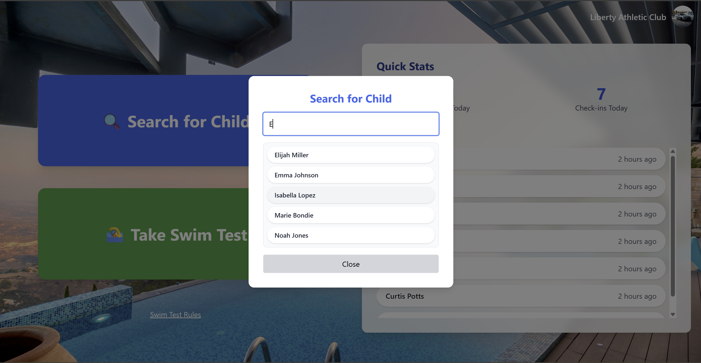

# 🏊 Swim Test App

A lightweight web application designed for swim clubs to log and manage children's swim tests and check-ins. Built with **React**, **Firebase Auth**, and **Firestore**.

---

## 📸 Screenshots




> _Add your own screenshots in a `/screenshots` folder in your repo._

---

## ✨ Features

- 🔐 Club-based authentication via Firebase
- 👶 Quick check-in and test logging for children
- 📈 Real-time dashboard with check-in/test stats
- 🔍 Search modal for returning children
- 💾 Firebase Firestore as the backend database

---

## 🛠️ Tech Stack

- React (Create React App)
- Firebase (Auth + Firestore)
- Tailwind CSS
- dayjs (for timestamps)
- react-hot-toast (for feedback)

---

## 🚀 Getting Started

1. **Clone the repo**

```bash
git clone https://github.com/your-username/swim-test-app.git
cd swim-test-app
